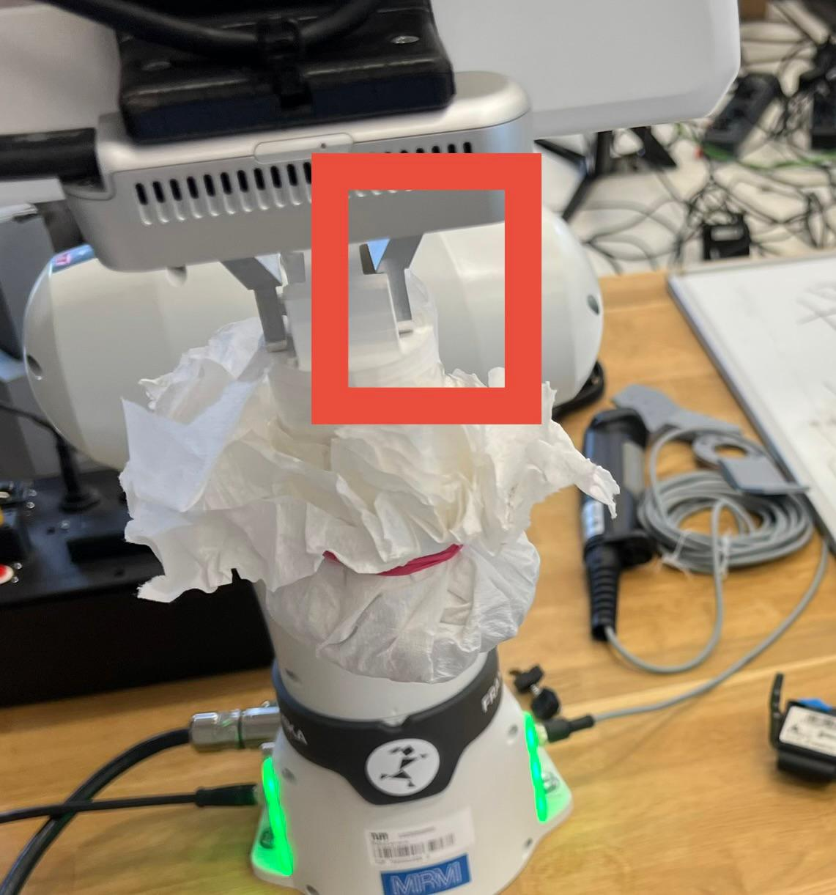

# IMPL Assignment Erasing

This assignment is about teaching a robot a motion along a surface and then execute this movement to erase a previously drawn image.
For that a Franka Research 3 robot is used holding a 3D printed tool, covered in cloth to clean and polish the drawing surface of a dry-erase whiteboard. 


<br></br>
### Getting started: 
1. Code source:
    - This project uses [ROS2 humble](https://docs.ros.org/en/humble/index.html)
    - We cloned the repository from the [Franka Github](https://github.com/frankarobotics/franka_ros2) with the commit **#4014bac**.
    - The packages **franka_bringup**, **franka_example_controllers** and **libfranka** are changed.
    Our work is based on the **"joint_impedance_controller.cpp"** from the [franka examples](https://github.com/frankarobotics/libfranka/tree/main/examples).
    - The ROS2 package [franka_description](https://github.com/frankarobotics/franka_description/tree/humble) is also needed in the ROS workspace.


2. Preparation
    - Setup the environment by sourcing following file: ```source /opt/ros/humble/setup.bash```
    - Navigate into the workspace folder "group1_erasing"
    - Build the workspace: ```colcon build --packages-select franka_bringup franka_example_controllers franka_description libfranka```. For the first time a ```colcon build --symlink-install``` is necessary.
    - Source the setup.bash from the install folder: ```source install/setup.bash``` 
    - Power on the robot. In the web interface of franka (Desk) unlock the brakes and activate FCI.

3. Operate the robots gripper
    - **Attention**: This is only necessary if you want to manually open or close the gripper. Otherwise proceed with **4.**, here all necessary steps are included already for executing the task.
    - Open the gripper: ```./build/libfranka/examples/grasp_object 172.16.0.10 0 0.06```
    - Place the cleaning tool to one tip of the gripper (see red box in the image). Press it carefully to the tip and it should hold itself. Do not hold the tool in your hand when the robot moves for your own safety.   <br>
      
    - Close the gripper with the cleaning tool inside: ```./build/libfranka/examples/grasp_object 172.16.0.10 0 0.006```
    - Additional information: The command for opening and closing was used from the already existing grasp_object of the libfranka examples. As arguments the robot-id is necessary as well as the distance from the center of the tool towards the tool tips in meters.  

4. Run control_erasing.sh in the workspace: ```./control_erasing.sh``` with elevated permissions. For this, click with the right mouse button on the file -> permissions -> then allow the file to be executed as program.
     This starts an interactive terminal that guides you through the erasing steps.
    - Teaching
        - Teaching is done without the cleaning tool. The old teaching file has to be deleted. This file is named ```joints_recording.txt``` and is saved directly in the workspace.
        - The robot moves to the starting position defined in the libfranka examples. Then teaching starts and the teacher can move the robot in the desired erasing area.
        - **Advice**: Large movements and repeatedly done movements work the best for teaching. Also keep in mind to be not too close to the whiteboard.
        - During the motion the joint values and time stamps are written into a .csv structured file.

    - Execute Erasing
        - After the gripper has opened mount the cleaning tool at the end effector of the robot and confirm. The gripper is then closed.
        - The robot starts again from the starting position defined in the libfranka examples. Now the joint values are read from the .csv file. Comparing to the actual timestamp the according joint value is being targeted. 
        - Wait until the robot is done with erasing and until it stops in a save position. 

In case something didn't work properly, just try to run the script again and be kind to the robot :)


[This video](https://youtu.be/jKivvzIEQQw?si=ZrySD5d-0xCNQYwl) shows the erasing of the IMPL-logo in real time.


### Happy erasing!  

<br></br>
### Under the hood

Based on the joint_impedance_controller we created two new controller for teaching and replay.
1. impl_group1_erasing_teach

   - This controller is used while teaching the trajectory. Here the robot is not getting any movement commands. During the hand-guided motion the joint positions and the timestamps are recorded in a .csv strucutred file joints_recording.txt.
   - The stiffness matrix is adjusted in the ```src/franka_bringup/config/controllers.yaml``` file. The first five joints are less stiff and the last two are stiffer than the original. 

        - The original values for the seven joints are:         
            - 24.0
            - 24.0
            - 24.0
            - 24.0
            - 10.0
            - 6.0
            - 2.0

        - We changed them to:
            - 18.0
            - 15.0
            - 12.0
            - 12.0
            - 10.0
            - 10.0
            - 4.0

            This change makes it easier for teaching to move the robot to the right positions. These values do not have to be exatly our values or changed at all. We just found these values good for manually moving the robot. We made the last two stiffer, that we can hold the robot at the gripper, while moving it.


2. impl_group1_erasing_exec
    - This controller is used for replaying the recorded trajectory. Here the controller is reading the trajectory file, compares the recorded timestamp with the actual timestamp and give the right position commands to the robot.
    - The stiffness matrix is adjusted in the ```src/franka_bringup/config/controllers.yaml``` file. The stiffnes of the first four joints are not changed, the last three joints are stiffer than the original.
        - The original values for the seven joints are:         
            - 24.0
            - 24.0
            - 24.0
            - 24.0
            - 10.0
            - 6.0
            - 2.0

        - We changed them to:
            - 24.0
            - 24.0
            - 24.0
            - 24.0
            - 15.0
            - 10.0
            - 4.0

        This helps to keep the tool more perpendicular to the erasing plane and prevent sticking at one place. 
        Less stiffness prevents the tool from sliding on the dry erasing board due to the friction, the robot joint would just move.
        More stiffness was also decreasing the erasing quality in our tests. The eslatic property allows the tool to smoothly slide along the plane and not hitting it too hard. It also corrects the natural small teaching errors by letting the tool move to the position, where most of the tool's surface touches the board.
        A deviation from these values is possible, when using another erasing tool or have changed the cloth at the tip of the tool. **Be aware**: These changes have a high impact to the quality of the erasing and the stiffness values might have to be adapted after changes were made!

------
Authors:  
Laura Schiller (03797770),  
Raimund Lau (03806149),  
Maximilian Reif (03671189)